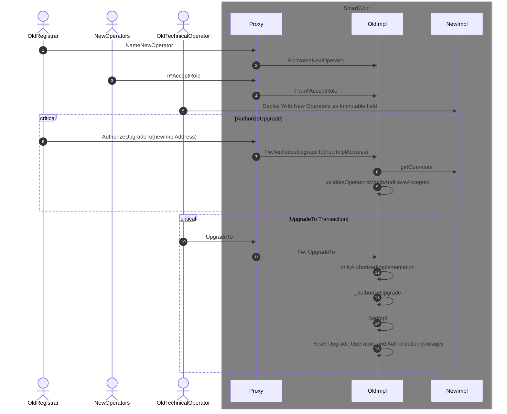

  

# Description

The `SecurityToken` contract is an ERC1155 with a few specifics.

### Set of operators with specific rights :

#### For the Whole Contract 
- The registrar operator :
    - mints tokens
    - burns tokens
    - force reviews (and either releases or cancels) transfers of tokens
    - names the operators for next implementation contract upgrade (ERC1155AccessControlUpgradeableV1.nameNewOperators)
    - authorises upgrade to next implementation contract (ERC1155AccessControlUpgradeableV1.authorizeImplementation)
- The technical operator :
    - only the technical operator can launch a (previously authorised) upgrade of the implementation contract (upgradeTo/upgradeToAndCall)

#### By Token Id
- The registrar agent operator :
    - initiate a safeTransferFrom
    - cancel a locked safeTransferFrom using the cancelTransaction method
- The settlement agent operator :
    - releases a locked safeTransferFrom using the releaseTransaction method

### Types of transfer:
- Direct safeTransferFrom:
    - direct transfer of tokens to the receiver
- Lock safeTransferFrom
    - locks the tokens in the holder address by the registrar agent
    - transfer could be canceled by the registrar agent or registrar (owner of the contract).
    - transfer could be released by the settlement agent or registrar (owner of the contract).

### Types of mints :
- Mint with data that contains (Settlement agent, Registrar agent and token URI)
    - set up a registrar agent and settlement agent for the token.
    - set up an URI for the token
    - mints the tokens to receiver address
- Mint with empty data
    - mints tokens to the receiver address (only if the token was previously minted)

### Satellite Contracts

The goal of a satellite contract is to improve individual token tracking in block explorers, it achieve it by implementing an ERC20 interface.

When a tokenId is minted a Sattelite Contract is deployed.

When the ERC1155 moves tokens it calls the corresponding satellite so to emit Transfer event. 

Read calls are forwarded to the ERC1155 contract, with the token id filled by the sattelite.

## Contract and Operator Upgrades

The implementation upgrade and operator upgrade are tied.
The goal of this is to lower gas cost of acces control check, by storing the operator in the bytecode, while keeping a secure way to update the Operators.

The main steps to perform an upgrade are :

- Registrar name the next Operators
- Each operator accept the role
- The actual Technical deploy a new contract
- The actual Registrar authorize the update to the new contract
- The actual Technical launch the UpgradeTo fonction
- The upgradeTo function checks each operator is Ok, then upgrade is performed

### Sequence Diagram

# Pre-requisites

1. Node.js 16.15
2. npm

# Usage

Configure an environment file `.env` using the example seen in `env.sample`
Install the package dependencies via `npm install`
Compile the project via `npm run build`

Deployment is done via hardhat by supplying a network to the `deploy` command as follows: `npm run deploy -- --network sepolia`

Unit tests can be run via `npm run test`, and code linting can be performed via `npm run lint`

# Bug Reports

Issues found in the project can be reported by opening an issue on this repository.
Pull Requests should adhere to the provided template.
